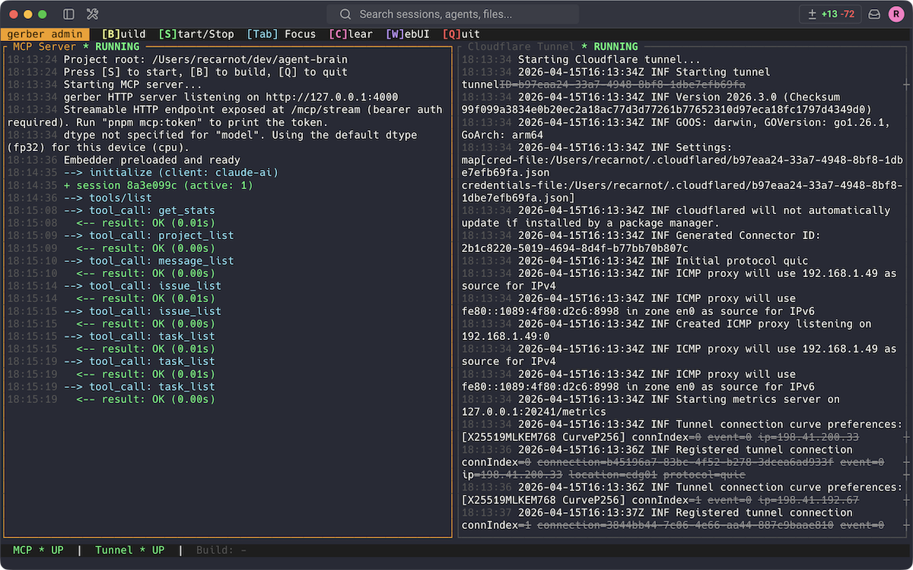
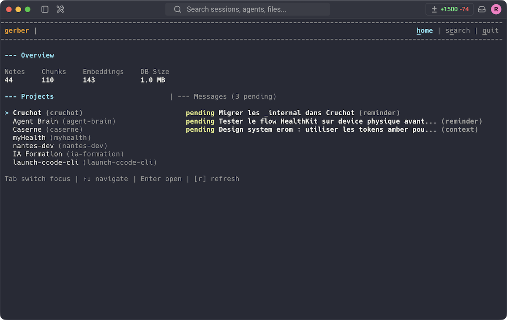

<p align="center">
  <picture>
    <source media="(prefers-color-scheme: dark)" srcset="assets/gerber-logo-dark.png">
    <source media="(prefers-color-scheme: light)" srcset="assets/gerber-logo-light.png">
    
  </picture>
</p>

<h1 align="center">Gerber</h1>
<p align="center">Cross-project memory & orchestration MCP server for AI coding agents.<br>Notes, tasks, issues, inter-session messages — with semantic & full-text search.<br>One brain, every agent.</p>

---

## Features

- **Notes** — Knowledge atoms and long-form documents, searchable via E5 embeddings
- **Tasks** — 7-column kanban (inbox → done) with subtasks, priorities, due dates
- **Issues** — Bug tracking with severity levels and 4-column workflow
- **Messages** — Inter-session bus for context and reminders between projects
- **Search** — Hybrid engine combining semantic similarity and full-text matching
- **Multi-client** — Claude Code, Claude Desktop, Gemini CLI, Codex, OpenCode, Kilo Code, Cline

## Screenshots

| Tasks kanban | Issues board |
|:---:|:---:|
|  |  |

| Admin TUI | Terminal UI |
|:---:|:---:|
|  |  |

## Quick Install (Claude Code)

```bash
git clone https://github.com/eRom/agent-brain.git
cd agent-brain && pnpm install && pnpm build
```

Add to `.mcp.json`:

```json
{
  "mcpServers": {
    "gerber": {
      "type": "stdio",
      "command": "node",
      "args": ["<path-to-agent-brain>/packages/mcp/dist/index.js"]
    }
  }
}
```

## Documentation

**[Read the full documentation →](https://gerber.gitbook.io)**

Covers installation for all clients, tools reference (26 MCP tools), plugin setup (13 skills, 2 agents), deployment (HTTP, Claude Managed Agent), architecture, and contributing guide.

## License

MIT
