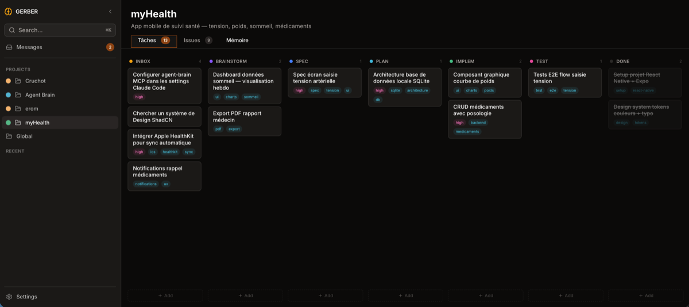
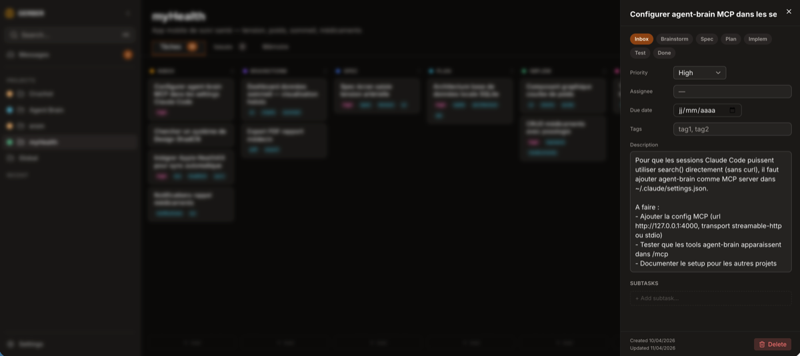
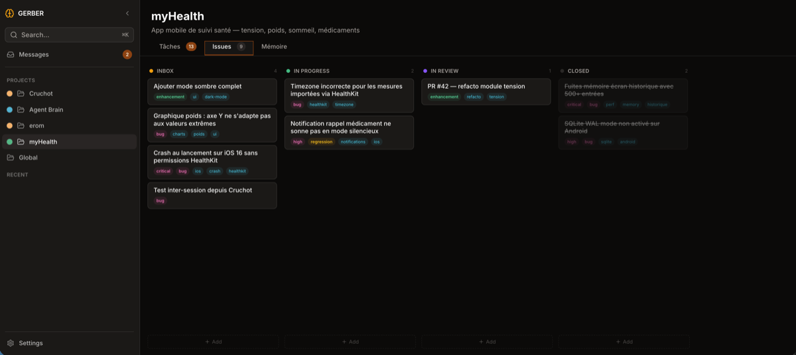
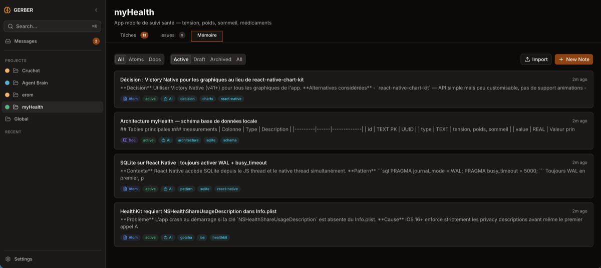

<p align="center">
  <picture>
    <source media="(prefers-color-scheme: dark)" srcset="assets/gerber-logo-dark.png">
    <source media="(prefers-color-scheme: light)" srcset="assets/gerber-logo-light.png">
    
  </picture>
</p>

<h1 align="center">Gerber</h1>
<p align="center">Cross-project memory orchestration for AI agents.<br>Store, search, and retrieve knowledge with full-text and semantic search.</p>

## Quick Start

```bash
pnpm install
pnpm build
```

## Development

```bash
pnpm dev          # Start MCP stdio + UI dev servers
pnpm test         # Run all tests
pnpm typecheck    # Type-check all packages
```

## Architecture

- `packages/shared/` — Constants, Drizzle schema, Zod schemas, TypeScript types
- `packages/mcp/` — MCP server (stdio + HTTP), SQLite database, E5 embeddings, AST chunker
- `packages/ui/` — React 19 + Tailwind CSS 4 + shadcn/ui frontend

## Screenshots

| Tasks kanban | Task detail |
|:---:|:---:|
|  |  |

| Issues board | Memory |
|:---:|:---:|
|  |  |

## Installation

### Claude Code

Add to `~/.claude/mcp.json` or project `.mcp.json`:

```json
{
  "mcpServers": {
    "gerber": {
      "type": "stdio",
      "command": "node",
      "args": ["<path-to-folder>/packages/mcp/dist/index.js"]
    }
  }
}
```

### OpenAI Codex CLI

Codex uses `~/.codex/config.toml` (TOML format):

```toml
[mcp_servers.gerber]
command = "node"
args = ["<path-to-folder>/packages/mcp/dist/index.js"]
enabled = true
startup_timeout_sec = 30
tool_timeout_sec = 60
```

### Google Gemini CLI

Add to `~/.gemini/settings.json` under `mcpServers`:

```json
{
  "mcpServers": {
    "gerber": {
      "command": "node",
      "args": [
        "<path-to-folder>/packages/mcp/dist/index.js"
      ]
    }
  }
}
```

### OpenCode

Add to `opencode.json` (or `opencode.jsonc`) — note the single `command` array:

```json
{
  "mcp": {
    "gerber": {
      "type": "local",
      "command": [
        "node",
        "<path-to-folder>/packages/mcp/dist/index.js"
      ],
      "enabled": true
    }
  }
}
```

### Kilo Code

Add to `~/.config/kilo/kilo.json` (global) or `./kilo.json` (project):

```json
{
  "mcpServers": {
    "gerber": {
      "type": "stdio",
      "command": "node",
      "args": [
        "<path-to-folder>/packages/mcp/dist/index.js"
      ],
      "disabled": false
    }
  }
}
```

### Cline

Edit `cline_mcp_settings.json` (VSCode → MCP Servers → Configure):

```json
{
  "mcpServers": {
    "gerber": {
      "type": "stdio",
      "command": "node",
      "args": [
        "<path-to-folder>/packages/mcp/dist/index.js"
      ]
    }
  }
}
```

## HTTP Mode (for UI)

```bash
node packages/mcp/dist/index.js --ui
# Serves on http://127.0.0.1:4000
```

> **Note:** `--ui` et le mode stdio ne peuvent pas coexister sur le meme process. Pour utiliser les deux, lancer deux instances separees (une sans `--ui` pour Claude Code, une avec pour le navigateur).

## Database

- Location: `~/.agent-brain/brain.db` (SQLite)
- Override: `--db-path /path/to/brain.db`

## Scripts

```bash
pnpm mcp:restore <backup-path>  # Restore from backup
pnpm mcp:reindex                # Re-chunk all documents
```

## Skills

Gerber ships with 10 slash-command skills for Claude Code. Copy `skills/` to `~/.claude/skills/` to install.

| Skill | Description |
|-------|-------------|
| `/gerber-onboarding` | Initialize a project in Gerber and configure the repo's CLAUDE.md |
| `/gerber-capture` | Quick-capture a knowledge atom (gotcha, pattern, decision) mid-session |
| `/gerber-recall` | Semantic + fulltext search across all projects |
| `/gerber-archive` | Extract and archive session learnings at session end |
| `/gerber-review` | Weekly maintenance — stats, stale notes, drafts, duplicates |
| `/gerber-import` | One-shot migration from `.memory/` / `_internal/` directories |
| `/gerber-inbox` | Check pending inter-session messages |
| `/gerber-send` | Send a context or reminder message to another project |
| `/gerber-task` | Manage project tasks (kanban: inbox → done) |
| `/gerber-issue` | Manage project issues (inbox → closed) |

A startup hook (`hooks/gerber-poll.sh`) polls pending messages and tasks on session start. See `hooks/settings.json` for the hook config.

## MCP Tools

### Projects

| Tool | Description | Parametres |
|------|-------------|------------|
| `project_create` | Creer un projet | `slug` (string), `name` (string), `description?`, `repoPath?`, `color?` |
| `project_list` | Lister tous les projets | `limit?` (number), `offset?` (number) |
| `project_update` | Mettre a jour un projet | `id` (string), `slug?`, `name?`, `description?`, `repoPath?`, `color?` |
| `project_delete` | Supprimer un projet (notes reassignees a global) | `id` (string) |

### Notes

| Tool | Description | Parametres |
|------|-------------|------------|
| `note_create` | Creer une note (atom ou document) | `kind` (string), `title` (string), `content` (string), `source` (string), `tags?` (string[]), `projectId?`, `projectSlug?` |
| `note_get` | Recuperer une note par ID | `id` (string) |
| `note_update` | Mettre a jour une note | `id` (string), `title?`, `content?`, `tags?` (string[]), `status?`, `projectId?`, `projectSlug?` |
| `note_delete` | Supprimer une note | `id` (string) |
| `note_list` | Lister les notes avec filtres | `kind?`, `status?`, `source?`, `projectId?`, `projectSlug?`, `tags_any?` (string[]), `tags_all?` (string[]), `sort?`, `limit?`, `offset?` |

### Search

| Tool | Description | Parametres |
|------|-------------|------------|
| `search` | Recherche hybride/semantique/fulltext | `query` (string), `mode?` (hybrid\|semantic\|fulltext), `limit?`, `projectId?`, `kind?`, `status?`, `source?`, `tags_any?`, `tags_all?`, `neighbors?` |

### Messages (Inter-session bus)

| Tool | Description | Parametres |
|------|-------------|------------|
| `message_create` | Creer un message inter-session | `projectSlug` (string), `type` (context\|reminder), `title` (string), `content` (string), `metadata?` |
| `message_list` | Lister les messages | `projectSlug?`, `type?` (context\|reminder), `status?` (pending\|done), `since?` (timestamp), `limit?` |
| `message_update` | Mettre a jour un message | `id` (string), `status?` (pending\|done), `content?`, `metadata?` |

### Tasks

| Tool | Description | Parametres |
|------|-------------|------------|
| `task_create` | Creer une tache | `projectSlug` (string), `title` (string), `description?`, `status?` (inbox\|brainstorming\|specification\|plan\|implementation\|test\|done), `priority?` (low\|normal\|high), `assignee?`, `tags?` (string[]), `dueDate?` (timestamp), `waitingOn?`, `parentId?` (UUID subtask) |
| `task_list` | Lister les taches | `projectSlug?`, `status?`, `priority?`, `tags_any?` (string[]), `parentId?` (UUID, filtre subtasks), `sort?`, `limit?`, `offset?` |
| `task_get` | Recuperer une tache + ses subtasks | `id` (string) |
| `task_update` | Mettre a jour une tache | `id` (string), `title?`, `description?`, `status?`, `priority?`, `assignee?`, `tags?`, `dueDate?`, `waitingOn?`, `metadata?` |
| `task_delete` | Supprimer une tache et ses subtasks | `id` (string) |
| `task_reorder` | Reordonner les taches | `ids` (string[]) — nouvelle ordre de position |

### Issues

| Tool | Description | Parametres |
|------|-------------|------------|
| `issue_create` | Creer une issue | `projectSlug` (string), `title` (string), `description?`, `status?` (inbox\|in_progress\|in_review\|closed), `severity?` (bug\|regression\|warning\|enhancement), `priority?` (low\|normal\|high\|critical), `assignee?`, `tags?` (string[]), `metadata?` |
| `issue_list` | Lister les issues | `projectSlug?`, `status?` (inbox\|in_progress\|in_review\|closed), `severity?`, `priority?`, `tags_any?` (string[]), `limit?`, `offset?` |
| `issue_get` | Recuperer une issue | `id` (string) |
| `issue_update` | Mettre a jour une issue | `id` (string), `title?`, `description?`, `status?`, `severity?`, `priority?`, `assignee?`, `tags?`, `relatedTaskId?`, `metadata?` |
| `issue_close` | Fermer une issue | `id` (string) |

### Maintenance

| Tool | Description | Parametres |
|------|-------------|------------|
| `backup_brain` | Creer un backup de la DB | `label?` (string) |
| `get_stats` | Statistiques du brain | `projectId?` (string) |

## License

MIT
