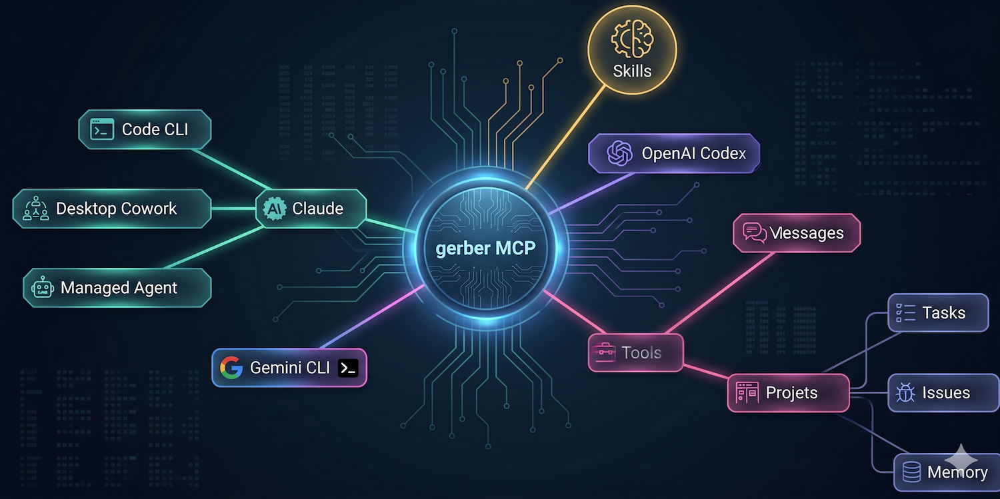

# Introduction

## What is Gerber?

Gerber is a persistent memory MCP server designed for AI coding agents. It gives agents a structured, searchable brain that survives across sessions and spans multiple projects.

Every time an AI agent starts a new session, it loses everything it learned in the previous one. It can't remember that a particular API has a quirk, that a task was blocked waiting on a dependency, or that a bug was already investigated and closed. Gerber solves this by providing a shared, queryable knowledge store — accessible to any MCP-compatible agent.

## The Problem

AI agents are stateless by default:

- **No session continuity**: every conversation starts from scratch
- **No cross-project knowledge**: patterns and decisions discovered in one project don't transfer to another
- **No coordination**: multiple agents or sessions working on the same codebase can't communicate
- **No structured work tracking**: tasks and issues live in external tools the agent can't write to

## The Solution

Gerber exposes a local SQLite database via the MCP protocol. Agents read and write structured data — notes, tasks, issues, messages — through a set of typed tools. The database is yours: it lives on your machine, under your control, and persists indefinitely.

The hybrid search engine (semantic + fulltext) means agents can retrieve relevant context with a single tool call, without knowing in advance where the information was stored or what it was tagged as.

## Key Features

### Notes

The primary knowledge unit. Two kinds:

- **atom** — short, self-contained facts: gotchas, patterns, decisions, one-liners. Fast to write, fast to retrieve.
- **document** — long-form content (architecture overviews, meeting notes, specs). Automatically chunked into overlapping segments for embedding-based search.

Notes support tags (up to 20), status tracking (`draft` → `active` → `archived` → `deprecated`), and source attribution (`ai`, `human`, `import`).

### Tasks

A 7-column kanban workflow built for software development:

`inbox` → `brainstorming` → `specification` → `plan` → `implementation` → `test` → `done`

Tasks support subtasks (via `parentId`), priority levels, assignees, due dates, and a `waitingOn` free-text field. They can be reordered within a column.

### Issues

A 4-column kanban for bug tracking and feedback:

`inbox` → `in_progress` → `in_review` → `closed`

Issues have severity levels (`bug`, `regression`, `warning`, `enhancement`) and can be linked to a task via `relatedTaskId`.

### Messages

An inter-session communication bus. An agent writing a `context` message leaves background information for the next session. A `reminder` message signals that an action is required. Messages are polled automatically at session start by the Gerber Claude Code plugin.

### Search

Three search modes:

| Mode | Engine | Use when |
|------|--------|----------|
| `hybrid` (default) | Semantic + FTS5 combined | General purpose retrieval |
| `semantic` | E5 embeddings, cosine similarity | Conceptual / fuzzy queries |
| `fulltext` | FTS5 BM25 | Exact terms, identifiers, error messages |

Searches can be scoped by project, note kind, status, source, and tags.

## Supported Clients

Gerber works with any MCP-compatible client. Installation guides are available for:

- [Claude Code](../installation/claude-code.md)
- [Claude Desktop](../installation/claude-desktop.md)
- [Gemini CLI](../installation/gemini-cli.md)
- [OpenAI Codex CLI](../installation/codex-cli.md)
- [OpenCode](../installation/opencode.md)
- [Kilo Code](../installation/kilo-code.md)
- [Cline](../installation/cline.md)
