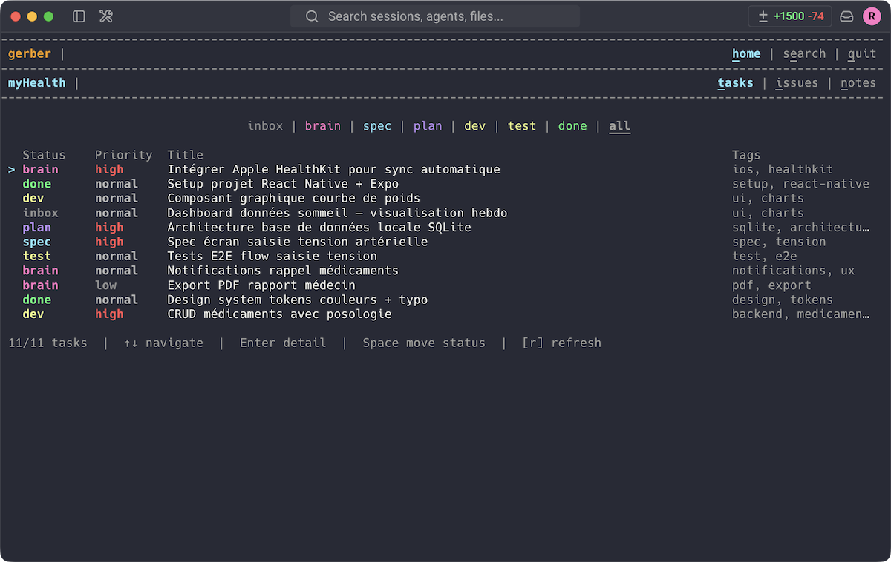

# Terminal UI

The terminal UI is an [Ink](https://github.com/vadimdemedes/ink)-based interface — React components rendered directly in the terminal. It provides a keyboard-driven way to browse Gerber data without leaving the command line.

## Launching

```bash
pnpm tui
```

## Screens

### Home

Project overview with aggregate stats: note count, open tasks, open issues, recent activity.

### Notes

Browse notes with inline filtering. Displays note type (atom/document), project slug, and tags.

### Tasks

Task list with status indicators mapped to the 7-column kanban workflow (inbox → brainstorming → specification → plan → implementation → test → done).

### Issues

Issue list with severity indicators across the 4 kanban statuses (inbox → in_progress → in_review → closed).

### Search

Full-text and semantic search across all data types, with results displayed inline.

## Navigation

Keyboard-driven. A persistent navigation bar at the top of the terminal shows available screens and their shortcuts. Use arrow keys and Enter to select items; `Esc` or `Q` to go back or quit.

## Screenshots



